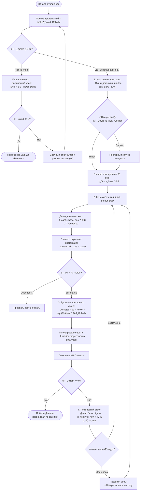

# Механика Баланса: «Давид против Голиафа» (Слабак побеждает Силача)
## Игровая логика, математика, физика и реализация в проекте «Остров поющей стали»

---

## 1. Введение: Суть архетипов

В классических RPG и формулах Lineage 2 C1 разница в «сырых статах» (HP, P.Def, P.Atk) создает иллюзию абсолютного превосходства тяжеловеса. Однако боевая система проекта `project-steam1` построена на детерминированном балансе асимметрий:

- **«Голиаф» (Силач)**: Тяжелобронированный боец (Механик со щитом, Разрушитель с двуручным молотом) или массивный автоматоно-босс (Тиран Свалки, Пресс-Молот).
  - *Преимущества*: Огромный запас HP ($CON \ge 43$), колоссальная физическая защита $P.Def$, шанс блока щитом до $70\%$, сокрушительный урон вблизи ($P.Atk \times 2$ при Soulshot).
  - *Критические слабости*: Малая подвижность, привязка к ближней дистанции ($R_{melee} = 3.5$ м), слабый контур схем ($MEN \le 25 \implies$ низкий $C.Def$), долгое время замаха ($T_{swing} = 133 / AtkSpd$).
  
- **«Давид» (Слабак)**: Тонкий дальнобойный класс (Инженер в робе, Конструктор, Стрелок).
  - *Преимущества*: Огромный радиус поражения ($R_{cast} = 30$ м, $R_{eff} = 55$ м), контурный урон схем ($C.Atk$), пробивающий металл и игнорирующий щиты, замедления/контроль (Ice Bolt $-20\%$ скорости, масляная лужа $-35\%$), ускорение каста в робе (`Spellcraft` $\times 2.0$), высокая скорость маневра.
  - *Критические слабости*: Запас HP на 1–2 удара ($HP_{David} \approx 120-200$), минимальная $P.Def$ (отсутствие щита и лат).

**Главная аксиома механики**:
> Прямой размен ударами в упор («лоб в лоб») означает $100\%$ гибель Давида. 
> Победа Давида строится на **кинематике дистанции**, **асимметрии типов защиты ($P.Def$ vs $C.Def$)** и **контроле таймингов (Stutter-Step kiting)**.

---

## 2. Блок-схема механики (Mermaid)



---

## 3. Физика процесса: Кинематика, дистанция и фазовый цикл

### 3.1. Уравнение движения и условия перехвата (Interception)
Пусть начальная дистанция между противниками $d_0 = 30$ метров (дальность атаки Давида).
- Скорость Давида на бегу: $v_D$.
- Скорость Голиафа: $v_G$.
- Радиус атаки ближнего боя Голиафа: $R_{melee} = 3.5$ м.

Если оба бегут по одной прямой, изменение дистанции описывается уравнением:
$$\Delta d(t) = d_0 + (v_D - v_G) \cdot t$$

Если $v_D > v_G$, то $(v_D - v_G) > 0$ — расстояние **увеличивается**, Голиаф асимптотически никогда не догонит Давида.

### 3.2. Фазовый цикл «Каст — Отбег» (Stutter-Step Kiting)
Давид не может двигаться во время каста заклинания/импульса.
Каждый цикл атаки состоит из двух фаз:
1. **Фаза каста ($t_c$)**: Давид неподвижен ($v_D = 0$). Голиаф бежит к нему со скоростью $v_G$.
   Потеря дистанции:
   $$\Delta d_{loss} = v_G \cdot t_c$$
2. **Фаза отбега ($t_r$)**: Давид разворачивается и бежит со скоростью $v_D$, Голиаф преследует его со скоростью $v_G$.
   Набор дистанции:
   $$\Delta d_{gain} = (v_D - v_G) \cdot t_r$$

**Критический критерий выживания Давида (Инвариант сохранения дистанции)**:
За один полный боевой цикл суммарное изменение дистанции должно быть неотрицательным:
$$\Delta d_{gain} \ge \Delta d_{loss} \iff (v_D - v_G) \cdot t_r \ge v_G \cdot t_c$$
$$\frac{t_r}{t_c} \ge \frac{v_G}{v_D - v_G}$$

### 3.3. Числовой расчет на реальных параметрах игры
- Базовая скорость моба / тяжелого бойца: $v_{base} = 4.0$ м/с.
- Под дебаффом *Охлаждающий шип (Ice Bolt, $-20\%$)*:
  $$v_G = 4.0 \times (1 - 0.20) = 3.2 \text{ м/с}$$
- Скорость Давида (легкая броня/роба, пассивка `Quick Step` или сервопривод):
  $$v_D = 5.4 \text{ м/с}$$
- Преимущество в скорости:
  $$v_D - v_G = 5.4 - 3.2 = 2.2 \text{ м/с}$$
- Время каста в робе (`Spellcraft` $\times 2.0$, $CastingSpd \approx 333$):
  $$t_c = 4.0 \cdot \frac{333}{333} \cdot 0.5 = 2.0 \text{ с}$$
- Потеря дистанции за каст:
  $$\Delta d_{loss} = 3.2 \cdot 2.0 = 6.4 \text{ м}$$
- Необходимое время отбега для компенсации:
  $$t_r \ge \frac{6.4}{2.2} \approx 2.9 \text{ секунды}$$

> **Вывод**: Пока Голиаф замедлен, Давиду достаточно пробежать ~3 секунды после каждого выстрела, чтобы Голиаф никогда не подошел на расстояние удара молота ($3.5$ м).

---

## 4. Математика боя и формулы урона

Все формулы взяты из боевого ядра `shared/l2-combat.js` проекта:

### 4.1. Контурный урон Давида по Голиафу (`circuitDamage`)
Урон схем рассчитывается по формуле Lineage 2 C1 для атакующей магии:
$$Damage_{circuit} = 91 \cdot \text{Power} \cdot \frac{\sqrt{C.Atk}}{C.Def_{Goliath}} \cdot \text{ShotMod} \cdot \text{rand}(0.90, 1.10)$$

Почему это сокрушительно для Голиафа?
- Защита схем рассчитывается как:
  $$C.Def = (BaseMDef - NakedJewelry + \Sigma JewelryMDef) \cdot MEN_{bonus} \cdot levelMod$$
- У тяжеловеса $MEN = 25$, что дает отрицательный бонус в формуле `statBonus`:
  $$MEN_{bonus} = \text{round}\left(1.010^{25 - (-0.060)} \times 100\right) / 100 \approx 0.78 \quad (-22\%!)$$
- В результате $C.Def$ Голиафа чрезвычайно мал ($\approx 40-50$).
- У Давида $INT = 41 \implies INT_{bonus} \approx 1.22$.
- Контурный урон наносит чистые $50-90$ единиц за импульс, игнорируя тяжелые латные доспехи!

### 4.2. Игнорирование блока щитом
В функции `resolveHit` в `l2-combat.js`:
```javascript
var blocked = false;
var hasShield = !!(defender.hasShield || defender.shieldDef > 0);
if (dtype === 'physical' && hasShield) {
    if (rollBlock(defender.shieldDef || 1, defender.pDef || 0, defender.blockBonus || 0)) {
        blocked = true;
        pDefEff = ((defender.pDef || 0) + (defender.shieldDef || 0)) * (1 - ignore);
    }
}
```
**Щитовой блок Голиафа работает ТОЛЬКО против физического урона (`dtype === 'physical'`). Против контурных импульсов Давида (`dtype === 'circuit'`) щит Голиафа бесполезен на $100\%$!**

### 4.3. Шанс прохождения замедления (`magicLandChance`)
$$P_{land} = \text{clamp}\left(BaseChance \cdot \frac{INT_{mod}(David)}{MEN_{mod}(Goliath)} \cdot \left(1 + \frac{Lvl_D - Lvl_G}{10}\right), 0.05, 0.95\right)$$
- $INT_{mod} = 0.8 + 41 \times 0.005 = 1.005$
- $MEN_{mod} = 0.8 + 25 \times 0.005 = 0.925$
- Отношение: $\frac{1.005}{0.925} = 1.086$
- При $BaseChance = 0.80$ и равных уровнях:
  $$P_{land} = 0.80 \times 1.086 = 86.9\%$$
Замедление накладывается с вероятностью **~87%**, гарантируя Давиду контроль над дистанцией.

---

## 5. Термодинамика пара: Баланс расхода энергии (Steam/MP)

Победа Давида невозможна, если у него кончится пар (Energy) до того, как упадет Голиаф.

### 5.1. Уравнение энергозатрат
Пусть здоровье Голиафа $HP_G = 1200$.
- Средний урон Давида за выстрел: $D_{avg} \approx 70$.
- Требуемое число попаданий:
  $$N = \left\lceil \frac{1200}{70} \right\rceil = 18 \text{ выстрелов}$$
- Базовая стоимость спелла: $Cost = 10$ пара.
- Модификатор экипированного жезла (`mpEquipMod` в `l2-combat.js`): $\times 0.90$.
  $$Cost_{final} = 10 \times 0.9 = 9 \text{ пара}$$
- Суммарный расход пара: $18 \times 9 = 162$ пара.

### 5.2. Регенерация пара в бою
- Базовый пул пара Давида на 10 уровне: $Energy_{max} \approx 100$.
- Время боя: $T = N \times (t_c + t_r) = 18 \times (2.0 + 3.0) = 90 \text{ секунд}$.
- Регенерация пара на бегу (`mpRegenPerTick` каждые 3 секунды, множитель позы `run` $= 0.7$, пассивка робы `eng_coolant_mind` $+20\%$):
  $$Tick_{mp} = \left(0.9 + 0.3 \cdot \frac{10 - 1}{10}\right) \cdot levelMod \cdot MEN_{bonus} \cdot 0.7 \cdot 1.20 \approx 1.8 \text{ пара / 3 сек}$$
- За 90 секунд восстановится:
  $$Regen_{total} = \frac{90}{3} \times 1.8 = 54 \text{ пара}$$
- Доступный баланс энергии:
  $$Energy_{pool} = 100 + 54 = 154 \approx 162 \text{ пара}$$

> **Вывод**: Математика расхода пара находится на тонкой грани — Давид побеждает Голиафа, расходуя почти весь резерв котла, что создает высочайшее игровое напряжение (high-stakes clutch gameplay).

---

## 6. Связка с исходным кодом проекта

| Механика баланса | Файл в проекте | Имплементированная функция / константа |
|---|---|---|
| Формула урона схем | [shared/l2-combat.js](file:///d:/games/yandex/лайнэйдж/project-steam1/shared/l2-combat.js) | `circuitDamage(cAtk, cDef, power, shotMod)` |
| Уязвимость бойцов по MEN | [shared/l2-combat.js](file:///d:/games/yandex/лайнэйдж/project-steam1/shared/l2-combat.js) | `statBonus(men, 'MEN')`, `STAT_BONUS.MEN` |
| Игнорирование щита магией | [shared/l2-combat.js](file:///d:/games/yandex/лайнэйдж/project-steam1/shared/l2-combat.js) | `resolveHit(...)` (проверка `dtype === 'physical'`) |
| Шанс замедления | [shared/l2-combat.js](file:///d:/games/yandex/лайнэйдж/project-steam1/shared/l2-combat.js) | `magicLandChance(baseChance, atkInt, defMen, atkLvl, defLvl)` |
| Скорость каста в робе | [shared/l2-combat.js](file:///d:/games/yandex/лайнэйдж/project-steam1/shared/l2-combat.js) | `mAtkSpd(wit, spellPct, setPct)` (множитель робы $\times 2.0$) |
| Время перехвата и дистанция | [shared/l2-combat.js](file:///d:/games/yandex/лайнэйдж/project-steam1/shared/l2-combat.js) | `distXZ(ax, az, bx, bz)`, `GAME_MAGIC_CAST = 30`, `GAME_MELEE_REF = 3.5` |
| Спелл замедления (Ice Bolt) | [shared/skill-db.js](file:///d:/games/yandex/лайнэйдж/project-steam1/shared/skill-db.js) | `eng_pressure_seal` (`slowPercent: 0.2`, `duration: 60`) |
| Скорость и статы Голиафа | [shared/mob-db.js](file:///d:/games/yandex/лайнэйдж/project-steam1/shared/mob-db.js) | `baseCurve(level)`: `hp`, `pDef`, `speed: 3.2 + L*0.04` |
| Экономия пара жезлом | [shared/l2-combat.js](file:///d:/games/yandex/лайнэйдж/project-steam1/shared/l2-combat.js) | `mpEquipMod(weaponClass)` (`MP_MOD_MAGIC_WEAPON = 0.90`) |
