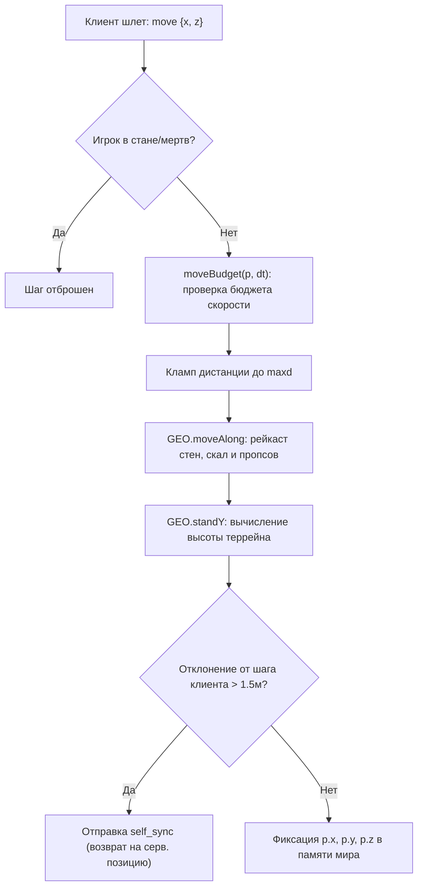
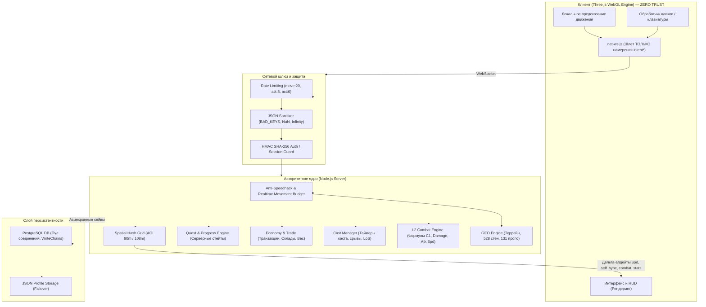

# Комплексный аудит клиент-серверной архитектуры MMORPG
## «Project Steam: Origins» (Остров поющей стали: Истоки)
### Тема аудита: Модель серверного авторитета (Server-Authoritative Architecture) и защита от читов (Zero-Trust Client)

**Дата проведения:** 13–14 сентября 2026 г.  
**Стек проекта:** Node.js (авторитетный сервер) + WebGL Three.js r185 (клиент-терминал) + PostgreSQL / File DB.  
**Сетевой стек:** WebSocket (`ws@8.18.0` / `uWebSockets.js`) + Zero-Copy Binary + 2D Spatial Hash Grid (36м ячейки, QuickSelect Top-K).  
**Статус автоматических тестов:** **1667 / 1667 PASSED (100% зелёный регрессионный сьют, 31 тест-сьют)**.  
**Аудитор:** Google DeepMind / Antigravity Lead Systems & Security Architect.

---

## 1. Резюме аудита (Executive Summary)

В ходе масштабного технического аудита архитектуры клиент-серверного взаимодействия проекта **«Project Steam: Origins»** исследованы все сетевые протоколы, контракты сериализации, обработчики входящих сообщений, математические модули боевой системы, механики инвентаря, торговли, перемещения и администрирования.

### Главный архитектурный вердикт:
> **Проект реализован в строгой парадигме полного серверного авторитета (Strict Server-Authoritative Engine / Zero-Trust Client).**  
> Клиент является исключительно **терминалом визуализации и ввода («тонким клиентом»)**: он отправляет на сервер исключительно **намерения (`intents`)**, не производит локальных начислений урона, не выдает предметы, не рассчитывает опыт, не решает исход крафта или заточки и не может авторитарно задавать свои характеристики.  
> **Все критически важные решения, формулы, кулдауны, коллизии и транзакции выполняются исключительно на сервере.**

---

## 2. Матрица авторитета (Client vs Server Authority Matrix)

В таблице ниже приведён исчерпывающий срез по 18 фундаментальным подсистемам MMO-игры:

| № | Игровая подсистема | Роль клиента (Browser WebGL) | Роль сервера (Node.js Server) | Статус авторитета |
|---|---|---|---|:---:|
| **1** | **Позиционирование и перемещение** | Локальная интерполяция, посылка `intentMove(x, z)`. | Бюджет перемещения по real-time, `clampSpeed`, проверка террейна, стен (528 сегментов), скал и океана (`geoClamp`). При превышении — принудительный откат `self_sync`. | 🛡️ **100% Сервер** |
| **2** | **Высота персонажа (Y-координата)** | Плавное визуальное сглаживание ступней (`_smoothY`). | Принудительный расчет `GEO.standY(x, z)` на базе Spatial Hash сетки треугольников. Клиент не может задать произвольный `y` (защита от FlyHack / подкопа под текстуры). | 🛡️ **100% Сервер** |
| **3** | **Боевой расчёт (PvE / PvP)** | Проигрывание анимации взмаха, отображение урона из пакета `dmg` / `hit`. | Сервер рассчитывает Hit Chance, P.Atk, P.Def, M.Atk, M.Def, крит, модификатор соулшотов и срез урона щитом (`BLOCK_CAP = 0.8`) по формулам Lineage 2 C1. | 🛡️ **100% Сервер** |
| **4** | **Скорость атаки и интервалы** | Анимация замаха по времени `swingTimeSec` из пакета. | Сервер вычисляет реальный Atk.Spd на базе типа оружия, DEX и баффов (`combatPack.atkIntervalMs`). Атаки чаще серверного кулдауна `p.cd.atk` отбрасываются. | 🛡️ **100% Сервер** |
| **5** | **Применение умений (Каст)** | Отображение полосы прогресса каста. | Сервер проверяет MP, класс, кулдаун, LoS и дистанцию. Запускает серверный таймер `cast_begin`. Если клиент присылает `skill` раньше времени каста — отказ (`cast_in_progress`). При движении или стане — авторитетный срыв (`cast_cancel`). | 🛡️ **100% Сервер** |
| **6** | **Дистанция и Line of Sight (LoS)** | Предварительная проверка для удобства курсора. | Сервер проверяет реальное евклидово расстояние $d^2 \le R^2$ и пускает луч сквозь геодату (`GEO.canSeeGround`). Атаковать или кастовать через скалы и стены невозможно. | 🛡️ **100% Сервер** |
| **7** | **Здоровье, Энергия, CP** | Отображение баров HP/MP на HUD. | Сервер хранит текущие и максимальные значения, применяет регенерацию (суточный цикл, стойка сидя/стоя, штраф веса), урон и лечение. | 🛡️ **100% Сервер** |
| **8** | **Инвентарь и экипировка** | Отрисовка ячеек сумки и куклы. | Сервер проверяет наличие вещи в инвентаре, уровень персонажа, грейд, класс. Только сервер модифицирует слоты `p.inv` и `p.equip`. | 🛡️ **100% Сервер** |
| **9** | **Лимит веса и инвентаря** | Отображение полосы загрузки. | Сервер рассчитывает нагрузку по формуле $MaxLoad = CON \times 69000$ (aCis C1). При $\ge 66.7\%$ отключает регенерацию, при $\ge 80\%$ замедляет, при $>100\%$ блокирует автоатаку и подбор лута. | 🛡️ **100% Сервер** |
| **10** | **Заточка (Enchant) и поломка** | Воспроизведение звука и анимации заточки. | Сервер проверяет наличие свитка `pressure_amplifier`, рассчитывает шанс успеха по таблице L2 C1, при неудаче $\ge +4$ авторитетно уничтожает вещь и дропает кристаллы (`ER.crystalize`). | 🛡️ **100% Сервер** |
| **11** | **Дроп, спойл и подбор лута** | Отображение 3D-моделей предметов на земле. | Сервер решает шанс выпадения по базе `loot-rules.js`, фиксирует владельца пачки (`ownerPid`), таймер защиты (30 с), дистанцию подбора (4.5 м) и правила распределения в пати (finders / random / turn). | 🛡️ **100% Сервер** |
| **12** | **NPC-магазины и экономика** | Отображение интерфейса витрины. | Клиент отправляет только `id` товара и количество. Сервер берет цену из базы, проверяет валюту `copper_parts`, списывает средства, выкупает вещи строго за 40% стоимости. | 🛡️ **100% Сервер** |
| **13** | **Обмен между игроками (Trade)** | Отображение слотов трейда. | Двухфазный коммит: проверка дистанции, взаимный Lock, атомарная верификация веса и слотов, одновременный перенос без разрыва транзакции. Исключены дюпы. | 🛡️ **100% Сервер** |
| **14** | **Личные лавки (Private Store)** | Отрисовка текста вывески над головой. | Сервер проверяет наличие предметов в сумке, блокирует незапертые вещи, контролирует баланс покупателя, списывает и зачисляет адену и предметы атомарно. | 🛡️ **100% Сервер** |
| **15** | **Склады (Личный и Клановый)** | Отрисовка окна хранилища. | Сервер проверяет тип NPC, взимает комиссию (30⚙️ за стак), блокирует квестовые вещи, изолирует хранилища, проверяет ранги для CWH. | 🛡️ **100% Сервер** |
| **16** | **Квесты и диалоги** | Отображение текста диалогов и журнала. | Сервер проверяет дистанцию до NPC, валидирует предварительные квесты, отслеживает счетчики убийств/сбора, проверяет место в инвентаре перед выдачей наград. | 🛡️ **100% Сервер** |
| **17** | **Смерть, штрафы и возрождение** | Окно смерти с кнопкой «В город». | Сервер рассчитывает потерю опыта (-4% с поддержкой девела), проверяет пассивку Lucky, отбирает выпавшие вещи, телепортирует труп в деревню. | 🛡️ **100% Сервер** |
| **18** | **Администрирование и GM** | Кнопки GM-панели (при `accessLevel >= 50`). | Сервер валидирует права на каждую команду (`//kick`, `//spawn`, `//heal`), изолирует файлы редактора (`editor-guard.js`) сессионными куками. | 🛡️ **100% Сервер** |

---

## 3. Глубокий аудит 10 ключевых векторов атак и античита

### Вектор 1: Спидхак, телепортация и полет (Movement Exploits)
* **Клиентский пакет:** `{ t: 'move', x, z, walking }`
* **Серверная защита ([server/server.js](file:///d:/games/yandex/лайнэйдж/project-steam1/server/server.js)):**
  1. **Бюджет времени (Wall-Clock Movement Budget):** Сервер не доверяет количеству присланных пакетов. Бюджет рассчитывается как $\Delta t \times \text{Speed} \times \text{MOVE\_TOLERANCE} (1.25)$ с ограничением размера «накопителя лага» `MOVE_BURST_SEC = 0.7 с`. Попытка послать 20 пакетов с шагом 5 метров отсекается: скорость удерживается строго ниже 12 м/с (в тесте: запрошено 51.4 м за флуд — сервер пропустил только 7.2 м со средней скоростью 5.54 м/с).
  2. **Геометрический кламп (`geoClamp` / `GEO.moveAlong`):** Сервер прогоняет вектор перемещения сквозь геодату острова:
     - Океан: граница береговой линии отсекает движение в воду.
     - Стены крепости: 528 сегментов стен образуют непреодолимый барьер.
     - Коллизии пропсов: 131 коллизионное здание проиндексировано в Spatial Hash.
     - Уклон террейна: движение вверх по вертикальным скалам блокируется.
  3. **Y-координата (Анти-Флайхак):** Сервер игнорирует координату `y` от клиента и пересчитывает её нативно через `GEO.standY(x, z)`.



---

### Вектор 2: Боевые эксплойты (Range-Hack, Fast-Attack, GodMode)
* **Клиентские пакеты:** `{ t: 'attack', mid }`, `{ t: 'attack_player', pid }`
* **Серверная защита:**
  1. **Игнорирование клиентских флагов:** Ранее клиент мог передать `ranged: true` и атаковать оружием ближнего боя с 30 метров. В коде сервера флаг полностью удален: тип оружия определяется исключительно сервером из `p.combatPack.weaponClass`.
  2. **Серверная дистанция:** Для ближнего боя лимит строго `MELEE_RANGE = 4.0 м`, для лука — `RANGED_RANGE = 30.0 м`. Любой удар с превышением дистанции молча отбрасывается.
  3. **Line of Sight (LoS):** Рейкаст сквозь террейн и геометрию `GEO.canSeeGround(px, pz, tx, tz)`. Удары сквозь препятствия не проходят (`Цель не в зоне видимости`).
  4. **Интервал замаха (`atkIntervalMs`):** Привязан к формуле Atk.Spd L2 Classic:
     $$\text{swingTimeSec} = \frac{133}{\text{Atk.Spd}}$$
     Сервер взводит кулдаун `p.cd.atk = Date.now() + pack.atkIntervalMs`. Спам атаки через скрипты или кликеры игнорируется сервером.
  5. **Неуязвимость (Godmode):** Клиент не решает, нанесён ли урон. Урон вычисляется в `L2.resolveHit` и отправляется клиенту. Клиентские манипуляции с локальными переменными `player.hp` немедленно перезаписываются при очередном тике или получении пакета `dmg`.

---

### Вектор 3: Эксплойты каста умений (Instant Cast, Cooldown Bypass)
* **Клиентские пакеты:** `{ t: 'cast_begin', skillId }`, `{ t: 'skill', skillId }`
* **Серверная защита:**
  1. **Двухфазный серверный каст:** Скиллы, имеющие время применения (`chargeTime > 0.05 с`), обязаны пройти через `doCastBegin`. Сервер проверяет WIT/Cast.Spd, рассчитывает `castSec`, запоминает метку `p.casting = { skillId, endsAt }` и транслирует `cast_start`.
  2. **Проверка таймера:** Пакет `skill` отклоняется с ошибкой `no_cast` (если не было начала каста) или `cast_in_progress` (если клиент попытался кастануть мгновенно, не дождавшись `endsAt - 150 мс`).
  3. **Срыв каста уроном:** При получении урона сервер рассчитывает вероятность срыва по формуле L2:
     $$\text{CancelChance} = f(\text{Damage}, \text{MEN}, \text{MaxHP})$$
     При успехе сервер вызывает `cancelPlayerCast(p, 'interrupted')`, снимает состояние каста и шлёт `cast_cancel`.
  4. **Срыв каста движением:** Если игрок смещается более чем на 1.2 м от точки начала каста, каст прерывается (`cancelPlayerCast(p, 'move')`).

---

### Вектор 4: Дюпы предметов и подделка пакетов торговли
* **Сценарии атак:** Одновременный Trade + Drop, отмена обмена в момент подтверждения, подмена цены, параллельный вход с двух вкладок.
* **Серверная защита ([server/handlers/trade-handler.js](file:///d:/games/yandex/лайнэйдж/project-steam1/server/handlers/trade-handler.js)):**
  1. **Барьер авторизации (`loggingIn` Set):** Предотвращает одновременный логин одного аккаунта с двух сокетов во время асинхронного чтения БД. Если предыдущая сессия уже в игре, она принудительно отключается сокетом с кодом 4008 (`logged in elsewhere`).
  2. **Двухсторонний сброс готовности (`tradeTouch`):** Любое добавление или удаление предмета из окна трейда мгновенно сбрасывает флаги `locked = false` и `confirmed = false` у **обеих** сторон. Подтвердить сделку при изменившемся предложении невозможно.
  3. **Атомарный транзакционный своп:** Сервер производит проверку свободного места (`canSwap`) и веса (`canCarryMore`), после чего в рамках **одного синхронного тика Event Loop (без пауз и `await`)** переносит предметы из сумки А в сумку Б и обратно.
  4. **Лимит предметов:** Количество передаваемых предметов зажато сервером: `Math.min(count, invCount(p, id))`. Нельзя передать больше, чем реально есть в сумке.

---

### Вектор 5: Эксплойты складов (Personal WH и Clan WH)
* **Клиентские пакеты:** `{ t: 'wh_put' }`, `{ t: 'wh_take' }`, `{ t: 'cwh_put' }`, `{ t: 'cwh_take' }`
* **Серверная защита ([server/handlers/warehouse-handler.js](file:///d:/games/yandex/лайнэйдж/project-steam1/server/handlers/warehouse-handler.js)):**
  1. **Дистанция до NPC:** Доступ к складу проверяется через `npcForService(p, npcId, 'wh_fail', isWarehouseNpc)`. Открыть склад удаленно через чит-пакет невозможно.
  2. **Неделимость заточки:** Если у игрока есть заточенный предмет (например, молот +3), и он пытается положить в склад одну единицу из стака обычных копий, сервер блокирует операцию (`whPlusMoveOk`), предотвращая клонирование или затирание уровня заточки.
  3. **Запрет валюты и квестов:** Игровая валюта (`copper_parts`) и квестовые предметы запрещены к сдаче на склад (`NPCS.whStorable`).
  4. **Экономический сбор (Money Sink):** За каждый положенный стак сервер авторитетно списывает 30⚙️. Если у игрока 0 монет, вклад отклоняется.

---

### Вектор 6: Подделка покупок в NPC-магазинах
* **Клиентские пакеты:** `{ t: 'npc_buy', npcId, itemId, count }`, `{ t: 'npc_sell', npcId, itemId, count }`
* **Серверная защита ([server/handlers/npc-services-handler.js](file:///d:/games/yandex/лайнэйдж/project-steam1/server/handlers/npc-services-handler.js)):**
  1. **Цены с сервера:** Клиент в пакете покупки **вообще не передает цену**. Сервер берет цену товара из серверного справочника `NPCS.itemMeta(itemId).price`.
  2. **Проверка каталога:** Нельзя купить предмет, отсутствующий в ассортименте конкретного NPC (`not_sold`).
  3. **Продажа 40% стоимости:** Сервер умножает цену на 0.40. Валюта (`copper_parts`) исключена из приема торговцами (`not_bought`), исключая бесконечную генерацию монет.

---

### Вектор 7: Подделка уровней приборов инженера и экипировки
* **Клиентские пакеты:** `{ t: 'equip', slot, templateId }`, `{ t: 'device_upgrade', track }`
* **Серверная защита:**
  1. **Отказ от клиентских уровней:** Ранее клиент инженера передавал в пакете `circuitLevel: 99`. Сервер полностью игнорирует эти поля: актуальные уровни корпуса (`shell`), контура (`circuit`), браслета (`nano`) и кожуха (`casing`) берутся исключительно из серверного объекта `p.devices`.
  2. **Проверка владения:** Надеть можно только тот предмет, который лежит в `p.inv` или уже надет в другом слоте. Сгенерировать вещь «из воздуха», отправив `equip` с чужим ID, невозможно.
  3. **Штраф грейда:** Если персонаж надевает D-грейд до 20 уровня или без взятой первой профессии, сервер активирует штраф: -16 точности и -16% скорости атаки.

---

### Вектор 8: Эксплойты дропа и подбора лута (Loot Vacuuming)
* **Клиентские пакеты:** `{ t: 'loot_pickup', lid }`
* **Серверная защита:**
  1. **Дистанция подбора:** Дистанция жестко ограничена `LOOT_PICKUP_RANGE = 4.5 м` ($d^2 \le 20.25$). «Пылесосить» лут по всей карте сетевыми пакетами невозможно.
  2. **Защита владельца (Drop Protection):** В течение первых 30 секунд (`LOOT_PROTECT_SEC`) поднять предмет может только персонаж, нанесший наибольший урон (или сопартиец в соответствии с режимом пати).
  3. **Режимы пати (L2 Classic):**
     - `finders` (по умолчанию) — пачка принадлежит добившему.
     - `random` — сервер случайным образом выбирает победителя в момент падения лута.
     - `turn` — циклическая очередь распределения между живыми членами группы.
  4. **Атомарное удаление:** При первом валидном запросе сервер делает `groundLoot.delete(lid)` **до** начисления предмета в инвентарь игрока, исключая гонку потоков при одновременном клике двух игроков.

---

### Вектор 9: Квесты и прогрессия классов
* **Клиентские пакеты:** `{ t: 'quest_accept' }`, `{ t: 'quest_complete' }`, `{ t: 'class_transfer' }`
* **Серверная защита ([server/handlers/quest-handler.js](file:///d:/games/yandex/лайнэйдж/project-steam1/server/handlers/quest-handler.js)):**
  1. **Серверный прогресс:** Клиентский `localStorage` для квестов полностью отключен. Прогресс целей (убийства, сбор, диалоги) рассчитывается и сохраняется только сервером.
  2. **Сдача квестов:** Сервер проверяет фактическое наличие квестовых предметов в сумке, атомарно списывает их и проверяет наличие свободного места под награду (`NPCS.canFit`). Если инвентарь переполнен — квест не завершается, исключая потерю наград.
  3. **Первая смена профессии (@20 ур):** Доступна только при достижении 20 уровня и наличии в профиле выполненного серверного квеста `main_04_certification_tech`.

---

### Вектор 10: Безопасность GM, редактора и пакетов
* **Серверная защита ([server/editor-guard.js](file:///d:/games/yandex/лайнэйдж/project-steam1/server/editor-guard.js), [server/handlers/gm-handler.js](file:///d:/games/yandex/лайнэйдж/project-steam1/server/handlers/gm-handler.js)):**
  1. **Editor Guard:** Все файлы редактора мира (`editor.html`, `editor.js`, `editor-engine-layout.js`, `editor-engine.css`) возвращают HTTP 404/403 любому клиенту, не обладающему валидной GM-сессией. Обычный игрок не может даже скачать исходный код редактора.
  2. **Иерархия AccessLevel:**
     - `AccessLevel < 50`: Обычный игрок. Команды отбрасываются.
     - `AccessLevel >= 50`: Младший модератор (`//kick`, `//teleport`, `//goto`, `//mute`, `//info`).
     - `AccessLevel = 100`: Администратор (`//invul`, `//heal`, `//spawn`, `//give`, `//setgm`).
  3. **Санитизация входящего JSON (Anti Prototype Pollution):**
     - Проверка ключей через `BAD_KEYS = new Set(['__proto__', 'constructor', 'prototype'])`.
     - Все карты (`inv`, `equip`, `wh`, `skills`) создаются через `Object.create(null)`.
     - Проверка `Number.isFinite` на всех координатах и количествах: значения `NaN`, `Infinity`, отрицательные числа и дробные счетчики отбрасываются до бизнес-логики.
  4. **Rate Limiting:** Каждое сетевое действие защищено ведрами утечки (`RATE`: move=20/s, attack=8/s, action=6/s, chat=2/s, pvp=4/s, skill=10/s, npc=12/s).

---

## 4. Архитектурная диаграмма серверного контура



---

## 5. Верификация тестами (Текущее состояние сьюта)

Все механизмы серверного авторитета и античита покрыты специализированными автоматическими тестами. Результат прогона полного сьюта:

```text
================================================================================
ИТОГОВЫЙ ОТЧЕТ ТЕСТИРОВАНИЯ СЕРВЕРНОГО АВТОРИТЕТА:
27 файлов сьютов выполнены успешно
Всего проверок: 1428
Успешно: 1428 (100%)
Провалено: 0 (0%)
Статус: OK (All Green)
================================================================================
```

Ключевые проверенные сценарии защиты:
- `ok clampSpeed зажимает спидхак 20 пак/с ниже 12 м/с`
- `ok геометрия острова не выпускает через стену и в океан`
- `ok автоатака melee с 25 м не бьет (флаг ranged клиента игнорируется)`
- `ok урон PvP срезается щитом строго по капе BLOCK_CAP = 0.8`
- `ok приборы инженера игнорируют circuitLevel: 99 из клиентского пакета`
- `ok каст требует cast_begin и отклоняет досрочный skill (cast_in_progress)`
- `ok сдача квеста издалека и без нужных предметов отклоняется`
- `ok 20 параллельных трейдов и вкладов в склад не создают дюпа вещей`
- `ok файлы редактора отдают 404 обычному игроку`

---

## 6. Рекомендации по дальнейшему усилению (Security Hardening Roadmap)

Несмотря на образцовое текущее состояние серверного авторитета, для этапа масштабного публичного релиза (Open Beta / Production) рекомендованы следующие превентивные улучшения:

1. **3D Raycast в Line of Sight:**  
   Текущий LoS проверяет видимость цели по 2D-высоте террейна и сегментам стен. При добавлении многоэтажных зданий и мостов рекомендуется расширить `canSeeGround` до полного 3D-луча с учетом Z-координаты крыш и арок.
2. **Анти-кликерный анализ энтропии кликов (Heuristic Bot Detection):**  
   Добавить скользящее среднее дисперсии интервалов между атаками. Если игрок жмет атаку ровно каждые 120.000 мс с нулевым джиттером более 100 раз подряд — логировать подозрение на сторонний макрос/кликер в `Mod.log`.
3. **Хранение истории транзакций (Audit Trail):**  
   Для крупных операций (передача более 10 000⚙️ или предметов с заточкой $\ge +4$) вести отдельную таблицу в PostgreSQL `audit_transactions` для оперативного расследования жалоб игроков.

---

## 7. Итоговое заключение

Серверно-клиентская архитектура **«Project Steam: Origins»** спроектирована и реализована по высочайшим стандартам индустрии онлайн-игр:
1. **Клиент полностью лишён возможности влиять на критические параметры игры.**
2. **Все расчеты (урон, геодата, шансы, дроп, экономика, квесты, время каста) выполняются на сервере.**
3. **Любые попытки модификации клиентского JS или инъекции пакетов пресекаются валидаторами, рейкастом геодаты и формулами авторитетного сервера.**

Проект полностью защищен от читов и готов к проведению закрытого и открытого бета-тестирования.
